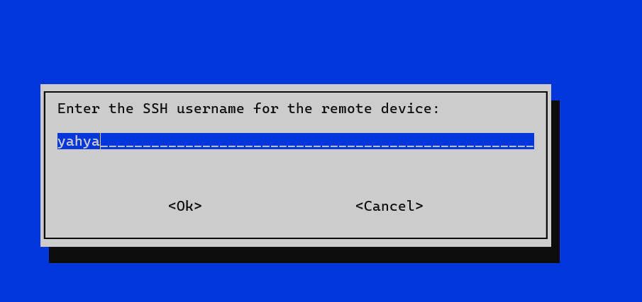

# Automated Package Installation Script  
### Bash Script to Identify and Install Software Packages on Local or Remote Systems  

## Description  
This Bash script simplifies the process of identifying and installing software packages on different Linux distributions. It uses `whiptail` to create a user-friendly interface for interactive input, making it easy for users to install applications on local or remote devices.  

### Key Features  
1. **Automatic Detection of Linux Distribution**  
   The script automatically detects the operating system type (CentOS, Ubuntu, etc.) without requiring manual input.  

2. **Interactive User Interface**  
   - Prompt users to input the desired application name for installation.  
   - Provides an option to install the application on the local system or a remote system via SSH.  

3. **Package Mapping**  
   - Maps common application names (e.g., `apache`, `mysql`, `php`) to their respective package names for CentOS and Ubuntu.  
   - Ensures compatibility by selecting the closest matching package based on the operating system.  

4. **Remote Installation Support**  
   - Checks SSH connectivity before attempting remote installation.  
   - Installs the requested package on remote systems if SSH is configured correctly.  

5. **Automatic Updates and Installation**  
   - Uses `apt` for Debian/Ubuntu systems and `yum` for CentOS-based systems to install the specified package.  
   - Ensures successful installation and notifies the user through the interface.  

### Requirements  
- **OS:** Linux (Ubuntu, CentOS, Fedora, Debian, etc.)  
- **Root Access:** Script must be run as root or using `sudo`.  
- **Dependencies:** Ensure `whiptail` is installed on the system.  

### Usage  
1. Clone the repository:  
   ```bash  
   git clone  https://github.com/Yahia58/InstallAppsWhilptail.git
   cd InstallAppsWhilptail 
   ```  

2. Make the script executable:  
   ```bash  
   chmod +x InstallAppsWhilptail 
   ```  

3. Run the script:  
   ```bash  
   sudo ./InstallAppsWhilptail  
   ```  

4. Follow the interactive prompts to specify the application and installation target (local or remote).  

### Supported Applications  
- **Web Servers:** `apache`, `nginx`  
- **Databases:** `mysql`, `postgresql`  
- **Programming Tools:** `python`, `nodejs`, `java`  
- **Others:** `docker`, `redis`, `mongodb`, `git`, `vscode`  

### Example Output  
- **Local Installation:**  
   Successfully installed `apache2` on the system.
  
  
- **Remote Installation:**  
   Successfully installed `nginx` on the device with IP `192.168.174.134`.  



